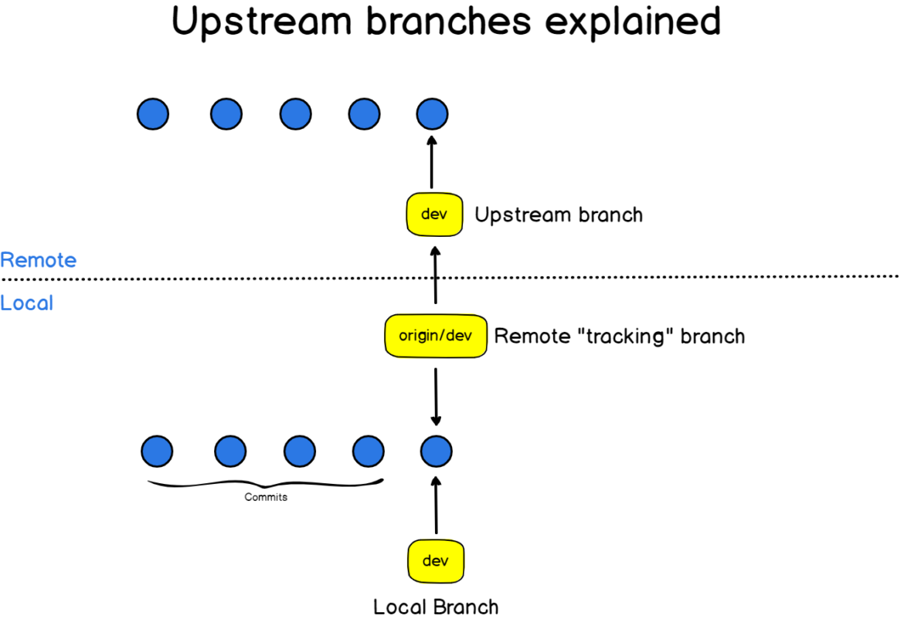
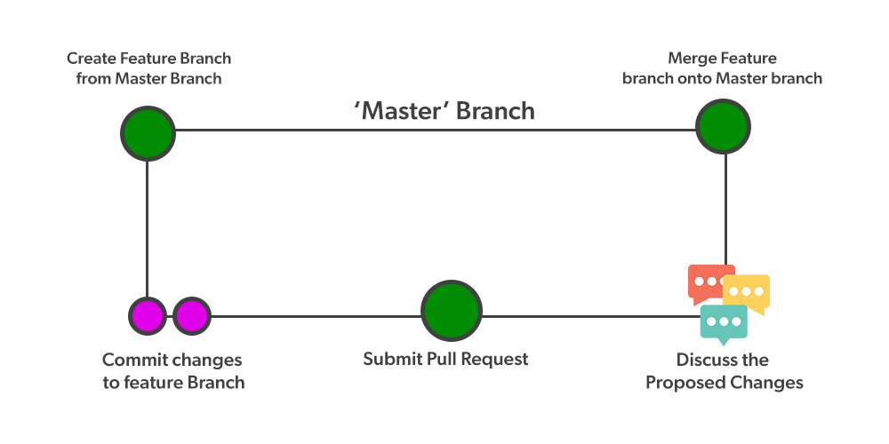

# ResBaz23-GitHub-Collaboration

Workshop for the 2023 Research Bazaar hosted by the University of Arizona. This workshop teaches the basics for using GitHub to collaborate on code for scientists, researchers, and anyone new to GitHub.

## Initializing a Git Repository from the Command Line

 In a terminal, such as the integrated terminal within R Studio, change your working directory to where you would like to create your new version controlled project. Replace `<folder/directory name>` with the name of the folder/directory where you would like the version controlled project to be created.

```Shell
cd <folder/directory name>
```

To create a new git repository from scratch, run the `git init` command with name of the project. The `<project name>` will also be the name of folder/directory in your file explorer. Here, 'repo' is short for repository, which is what version controlled projects are called in git terminology.

```Shell
git init <repo name>
```

Because we created this project from a local terminal, it currently only exists on our local computer and doesn't yet exist on GitHub. We need to add a location to put this repo on GitHub, and we do this by running the `git remote add` command. Here we can change the name `<origin>` to anything we want, `<origin>` is a 'shortname' for the git repo on GitHub ^[https://git-scm.com/book/en/v2/Git-Basics-Working-with-Remotes]. Git uses shortnames as an alias for the URL of the repo. This is helpful so we don't have to type the URL every time we want to push (upload) our code to GitHub. Here we replace the `<URL>` with the URL for the repo on GitHub, e.g.  `https://github.com/<username>/<repo>`

```Shell
git remote add <shortname> <URL>
```

Run this command to add a remote to this repo. You may not need to run this code if you didn't initialize this repo, but used `git clone` to download a local copy of the repository.

```Shell
git remote add origin https://github.com/amantaya/ResBaz23-GitHub-Collaboration
```

We can check if the git repo is connected to GitHub or any server by running the `git remote` command. Here we supply the `-v` flag to the `git remote` command to specify that we want the 'verbose' output which will show us the URL corresponding to the location of the git repo on GitHub.

```Shell
git remote -v
```

Depending on how you initialized your git repo, you may need to tell git to track changes for your local branch, and associate those changes with a remote branch on GitHub. In the example below, `origin/main` is the name of the remote (`origin` - which is the shortname for the URL on GitHub) and the remote branch is `main`. The name of our local branch is also `main`.

I found this diagram very helpful to understand the differences between local branches and remote branches.


Credit: ^[https://devconnected.com/how-to-set-upstream-branch-on-git/]

It can be somewhat confusing having a remote branch and local branch with the same name. Just remeber that you are most likely working with a local branch names `main` and then pushing your commands to the remote tracking branch also called `main`. Branching strategies for [DevOps](https://www.atlassian.com/devops) workflows are numerous and can be complicated ^[https://www.bmc.com/blogs/devops-branching-strategies/].

I would recommend setting this up once and keep the names of the local and remote branches the same, and then not thinking about which is which again to save your brain from hurting (or at least mines does when I think about it for too long). Here we set the 'upstream' branch (the remote tracking branch) to `origin/main`.

```Shell
git branch --set-upstream-to=origin/main main
```


Th `git branch -a` command can be useful to print out a list of branches both local and remote branches. The `-a` flag tells git to list all of the branches, both local and remote. Omitting the `-a` causes git to print only your local branches ^[https://git-scm.com/docs/git-branch].

```Shell
git branch -a
```


Next, let's create a new file called `somecode.R` and try pushing that code to GitHub to test if we set up our remote correctlu. The `touch` command creates a new file with the `.R` file extension.

```Shell
touch somecode.R
```

>[!Help]
>The `touch` command does not work in PowerShell. Be sure to use a different shell, such as Bash or Zsh.
>


We can see this new file `somecode.R` in the **Files** pane in the lower right side of R Studio.

Let's run a `git status` command to see if the newly created file shows up in git.

```Shell
git status
```


We need to add the new file to git so git knows to start tracking this file in version control. Where `somecode.R` is the name of the file we created in the previous step.

```Shell
git add somecode.R
```


You can also click the checkbox in the **Git** pane on the top-right of R Studio. If you do that, R Studio will run `git add` in the background for you to add that file to version control.

What does that small green "A"  icon next to `somecode.R` mean? It means `somecode.R` was added to version control (literally R Studio ran `git add somecode.R` in the background for you).


Now we run the `git commit -m` command with an admittedly not very informative commit message. The `-m` flag and the `"added some R code"` is the commit title, sometimes called the commit message. Try to keep the commit title at about 50 characters but feel free to hit enter after the commit title and add a description to the commit, keeping every subsequent line around 72 characters (i.e. the 50/72 rule) ^[https://dev.to/noelworden/improving-your-commit-message-with-the-50-72-rule-3g79].

```Shell
git commit -m "added some R code"
```

Or feel free to use the **Git** panel at the top right in R Studio to author your commit message. We don't see anything in the "Changes" panel because `somecode.R` is blank.


If we run `git status` again in the terminal, we see that our branch is ahead of 'origin/main' by 1 commit.

```Shell
git status
```


Remember that `origin/main` refers to the remote tracking branch `origin` on GitHub. `On branch main` is the name of the branch we are currently on with our local git repo (more on branches later...).

Then we can run `git push` command to push our local branch to GitHub.

```Shell
git push
```


## Collaborators vs. Forks

There are two primary ways for someone other than yourself to interact with your code. Since you created the GitHub repository, you are the *repository owner* which means you control access to your repository. As the repository owner, you get to decide who can directly contribute to your code.

The first way is by adding someone to your GitHub repo as a *Collaborator*. This is perhaps the most straightforward way to grant someone access to your repository.

A *Collaborator* is someone with a GitHub account that you give permission to read and write access to your code on GitHub. You can add a collaborator to a Public or Private repository on GitHub ^[https://docs.github.com/en/account-and-profile/setting-up-and-managing-your-personal-account-on-github/managing-access-to-your-personal-repositories/inviting-collaborators-to-a-personal-repository].

The second way is when someone *forks* your GitHub repo. A *fork* is when someone has their own entire copy of your repo, but doesn't have direct write access your repo ^[https://docs.github.com/en/get-started/quickstart/fork-a-repo]. That person makes changes to their copy of your code and then can submit a *Pull Request* to propose changes to your code. Pull Requests can be useful to allow people outside your team to contribute code without them having direct write access to your code. Merging code from a Pull Request is completely optional ^[https://docs.github.com/en/pull-requests/collaborating-with-pull-requests/proposing-changes-to-your-work-with-pull-requests/about-pull-requests].

>**Danger**
>A personal GitHub account doesn't give you much control over what a collaborator can edit and potentially delete. Be very careful to grant access to only those people who you trust with your code. An Enterprise GitHub account gives the repository owner more control over who can edit parts of the code, but of course an Enterprise accounts costs a monthly subscription. I don't have an Enterprise account and you may not either, so we will proceed with caution on who we add as *collaborators* to each of our GitHub repos.

For this workshop, we will be adding people as collaborators.

To add someone as a collaborator, click the Settings icon.


The **Collaborators** section is where you can add GitHub users to access *this specific GitHub repo*. Each repo has it's own list of collaborators, or even no collaborators if you want to be the only person writing the code.


When you invite someone to be a collaborator, they will receive a notification at the bell icon at the top right of their GitHub account, next to their username icon. Click on the notification icon to read the invitation.


The person you want to add as a collaborator will need to accept the invitation.


Once that person accepts the invitation, they will see a banner that says "You now have push access to the `<repository name>` repository."


You can check who has access to your repository by checking that *Collaborators* section under the *Settings*. You can also remove people from accessing your repository by clicking the "remove" button next to their username.


In R Studio, open the **terminal** (not the R console). The **terminal** runs a shell of the operating system, allowing the user to interface with the operating system through a command line interface.

>[!Help]
>Shells can come in many different types, such as Zsh (MacOS), bash (Linux) or PowerShell (Windows). These shells are not mutually exclusive, you can have multiple shells on single computer.

In the example below, we are using bash to run these commands. I highly recommend downloading [git bash](https://git-scm.com/downloads) especially if you are a Windows user, as some of these commands might not work in PowerShell.


To contribute code to a GitHub repository, the collaborator will need to `git clone` your repo. `git clone` downloads a copy of the remote repository and sets up the references that git uses to track each file's history.

```Shell
git clone https://github.com/amantaya/ResBaz23-GitHub-Collaboration.git
```


>**Note**
>`git clone` implicitly sets the `origin` remote automatically. ^[https://git-scm.com/book/en/v2/Git-Basics-Working-with-Remotes]

...and then change your current directory to name of the repo

```Shell
cd ResBaz23-GitHub-Collaboration
```

The collaborator can check if the remote (GitHub) is pointing to the correct GitHub repo by running:

```Shell
git remote -v
```


The `-v` flag means 'verbose' output - git will print the remote's shortname (in our case `origin`) and the URL of `origin` which is `https://github.com/amantaya/ResBaz23-GitHub-Collaboration.git`.

I find the `git remote -v` very helpful to figure out where the commit would go (or try to go - it may get rejected if you don't have write permission) if you were to push the commit to GitHub.

If you were added as a collaborator to the GitHub Repo, then you should be able to push a commit to a repo that you don't own, but have read and write access to.

What happens if you try to push a commit to a repo don't have read and write access to?

The commit gets rejected.


On GitHub, when another person pushes a commit to the repo, their username is added to a *Contributors* section at the lower right of the main repo page.


> **Note**
> A contributor's username will still show up as being a ***contributor*** *even after being removed as a **collaborator***. Note the use of the term *contributor* vs. *collaborator*. This may be somewhat confusing, just remember that a *collaborator* is someone who has direct access to the repo, and a *contributor* is someone who has contributed code to the repo at some point in time.

## Download Changes to Code with `git pull`

When you start working for the day, run either `git fetch` or `git pull` to retrieve anything that might have been changed by your collaborator(s) since you last worked on the code.

>**Note**
>The `git pull` command is actually two commands: `git fetch` and `git merge`, mean that `git pull` will fetch the code from GitHub (downloading the code) and merge the changes (if any) into your current code on your machine. If there are any merge conflicts, `git pull` will usually fail and print a warning message that the pull could not be completed due to a 'merge conflict'.

A **merge conflict** is when the two people have changed the same line in the same file, or when one person has modified a file while the other person deleted the file. ^[https://www.atlassian.com/git/tutorials/using-branches/merge-conflicts]

>**Note**
> You can set your `git config --global pull.rebase true` options to automatically rebase the git repo, rewriting the repo's history on your copy of the git repo when a `git pull` command returns a merge conflict. I would generally not recommend setting this option to `true` unless you are experienced with git and understand how a 'rebase' will affect your git history.

>**Warning**
>If your collaborator is working on the code synchronously (at the same time as you), have each collaborator run `git push` and then `git pull` frequently to synchronize the changes in code. This will also help detect merge conflicts early before they become big problems.

Running `git fetch` retrieves the references from the remote, in our case the remote is GitHub. References are what git uses to track the changes to each file and uses to keep a version history for each file. `git fetch` ***does not*** automatically try to merge the changes.

```Shell
git fetch
```


When we run the `git pull` command, it fetches any changes from GitHub, and then merges those changes into your local copy of the code. `git pull` ***does*** automatically try to merge the changes to the code and is my preferred method.

```Shell
git pull
```


Notice that git tells us what has changed, namely 2 files called `somecode.R` and `somemorecode.R`. Git also tells us that 7 lines of code were inserted into `somemorecode.R`.

Also notice git tells us it used the *fast-forward* method of merging two branches. The fast-forward method is where your local branch has the commits from your collaborator added to your branch's commit history (in this case a branch is from each person and each person's branch is called main - yes, it get's confusing fast), and then git brings you to the most recent commit on your current the branch called the HEAD. ^[https://blog.mergify.com/what-is-a-git-merge-fast-forward/]

## Writing Code Collaboratively

Writing code collaboratively can be very challenging. Collaborators need to agree on a unified coding style and way of approaching problems. Fortunately, there are an abundance of tools such as linters to enforce coding styles, and strategies for dealing with *merge conflicts*.

When you write code collaboratively with another person, you do so *asynchronously*, that is you work with your local copy of the code and the other person(s) works with their own local copy of the code. Only when you push or pull from a remote such as GitHub do the copies of the version history meet and git tries to reconcile the versions for each file.

Working asynchronously comes with freedom to work independently, but also comes at the cost of dealing with conflicting versions of files and their version histories.

When git cannot automatically merge the different histories of the same file, then you have a *merge conflict* ^[https://www.atlassian.com/git/tutorials/using-branches/merge-conflicts]. Merge conflicts typically require human intervention to decide what parts of the code to keep.

One strategy to avoid merge conflicts is by using a DevOps Branching Strategy ^[https://www.bmc.com/blogs/devops-branching-strategies/]. This is a huge topic and the source of considerable debate.

For this workshop, we will use the relatively simple GitHub Flow branching strategy ^[https://www.geeksforgeeks.org/git-flow-vs-github-flow/#].

### The GitHub Flow Branching Strategy

 Credit ^[https://media.geeksforgeeks.org/wp-content/uploads/20220214111138/GitHubFlow.jpg]

GitHub flow is a simple branching strategy where each person creates a new branch typically called `feature` for development. Once the code on the `feature` branch is ready to be integrated into the `main` branch, the person submits a *Pull Request* for others to review. During the pull request, others can discuss the proposed changes and make any necessary edits to the files. Once the pull request has been approved, the code from the `feature` branch is merged back into the `main` branch, and the feature branch is typically deleted.

>**Note**
> I set up a branch protection rule to prevent users directly pushing commits to the `main` branch on GitHub. Branch prtoection rules can be helpful to ensure code is reviewed before it enters production ^[https://docs.github.com/en/repositories/configuring-branches-and-merges-in-your-repository/managing-protected-branches/about-protected-branches]

First we will create a new branch called `andrew/feature`. The `-c` flag creates a new branch called `andrew/feature` and the `git switch` command changes your current branch to this new branch.

```Shell
git switch -c andrew/feature
```


I named the branch `andrew/feature` so I know who is working on that branch and what it's for (i.e. to develop a new feature).
You can also create a new branch using the Git pane in R Studio by clicking the  button.


Next, edit the file `merge-conflict-example.R`  on line 16. Change `pch = 1` and `col = "red"`.


Then we need stage `merge-conflict-example.R` by running `git add merge-conflict-example.R` in the terminal, or clicking the checkbox next under the "Staged" column in the Git pane in R Studio.


When you click the Commit button, we see the `git diff` which shows us what has changed. The red line indicates the old version of line 16 and that the line has been changed. The green line indicates the new version of line 16 and shows what has been added. You might have to look closely at the line to see exactly what has been changed.


Then, add a descriptive commit message title/subject...


and then commit the changes...


However, before we can push our changes to GitHub, we need to add the branch we just created `andrew/feature` to GitHub.

```Shell
git push --set-upstream origin andrew/feature
```


## Comparing and Discussing Changes to Code

Now that we pushed changes to a new branch `andrew/feature` on GitHub, we see a new banner pop up that says "andrew/feature had recent pushes less than a minute ago" and a very help green button called "Compare & pull request".

We will hit that green button to open a pull request to merge our proposed changes from `andrew/feature` into `main`.


When you open a pull request on GitHub, GitHub will automatically determine if the pull request can be merged, or if it can't because of a merge conflict.

Everything looks good, so we will hit the button "Create pull request".


Because of the branch protection rules, at least 1 approving review is required by a reviewer with write access.

The "Conversation" tab is a great place to discuss why the change to the code has taken place.


There is a ton of useful information in the other tabs "Commits", "Checks", and "Files Changed." I would recommend you look at each tab.

For example, under the "Checks" tab you can use a GitHub Action to run the `lintr` R package to enforce a unified coding style. If the check doesn't pass, then the pull request shouldn't be merged.

Under the "Files changed" tab, you can see exactly what has changed for each file included in the pull request. GitHub also helpfully highlights the exact parts of the line that have changed.


The collaborators may need to have a discussion in the "Conversation" tab before the pull request can be approved. Each collaborator can click the "Review changes" button and leave a comment on the proposed changes, or if they're satisfied with the changes, approve the pull request.


Once the pull request is approved, it can be merged into the `main` branch and the `andrew/feature` branch can be deleted. The pull request is also closed.


You should now see on the main page for the repo a commit with "Merge pull request #1 from amantaya/andrew/feature".


## Dealing with Merge Conflicts

Perhaps the hardest part in collaborating on code with Git/GitHub is when there are merge conflicts.

When git cannot automatically merge the different histories of the same file, then you have a *merge conflict* ^[https://www.atlassian.com/git/tutorials/using-branches/merge-conflicts].

### Creating a Merge Conflict Example

We will have to create a merge conflict to demonstrate how to resolve a merge conflict.

First, we will need to switch back to the `main` branch and pull those changes we made on GitHub into our local copy of the code.

```Shell
git switch main
```

But since we merged the pull request from `andrew/feature` into `main` on GitHub, our local copy still contains a reference to `andrew/feature`. The `-r` flag shows on the branches that exist on the remote (GitHub).

```Shell
git branch -r
```


We can remove the reference to the non-existing remote  `andrew/feature` by running

```Shell
git remote prune origin
```


Now let's create a new branch called `feature`.

```Shell
git switch -c feature
```


And open up the file `merge-conflict-example.R` again and this time edit line 18 and 19.

```R
# add a linear model
lm(petal_length ~ petal_width)
```


Stage and commit the file, adding a descriptive commit message.

```Shell
git add merge-conflict-example.R
```

```Shell
git commit -m "add a simple linear model"
```

and then push to GitHub, setting the upstream branch `feature` in the process.

```Shell
git push --set-upstream origin feature
```


Now, have someone else try to add a histogram on line 18 and 19 of `merge-conflict-example.R` stage and commit the file.

```R
# view a histogram of petal length
hist(petal_length)
```

Now when you `git pull` you receive an error message "Automatic merge failed; fix conflicts and then commit the result".


You will notice that git inserted a few lines into the `merge-conflict-example.R` at lines 18-24. The `<<<<<<<< HEAD` is the start of the merge conflict, `=======` is the divider between the merge conflict, and `>>>>>>>` is the end of the merge conflict.

To resolve the merge conflict, all you have to do is edit the `merge-conflict-example.R` file and remove the lines you don't want, save the file, stage the file and commit.


Notice that we deleted the linear model on lines 21-24 and kept the histogram.


There is helpful video on dealing with merge conflicts in R [here](https://youtu.be/97m0N4zIvOs)

>**Warning**
>Git will tell you where the merge conflicts are, but you and your collaborators will have to decide what code to keep.

>[!Pro Tip]
>If you ever run into problems with your git repo, I would highly recommend that your create a copy of your repo with `git clone --mirror` which downloads and creates a local copy of your git repo without the files, but keeps all of the history and references ('refs' in git terminology). This way you can try a series of troubleshooting steps (and potentially making mistakes along the way) to achieve your desired outcome in a safe way.

## Typical Workflow

1. Start work for the day, first thing you should do is `git pull`.
2. Address any merge conflicts from the git pull.
3. Write some code.
4. Stage your modified files for commit with `git add <files>`
5. Commit those files to version control `git commit -m "descriptive commit message"`
6. Push those files to GitHub `git push`

Open a pull request on GitHub when you are ready to merge your changes into the main branch.

Create new branches as needed with `git switch -c <branch_name>`.

## References
